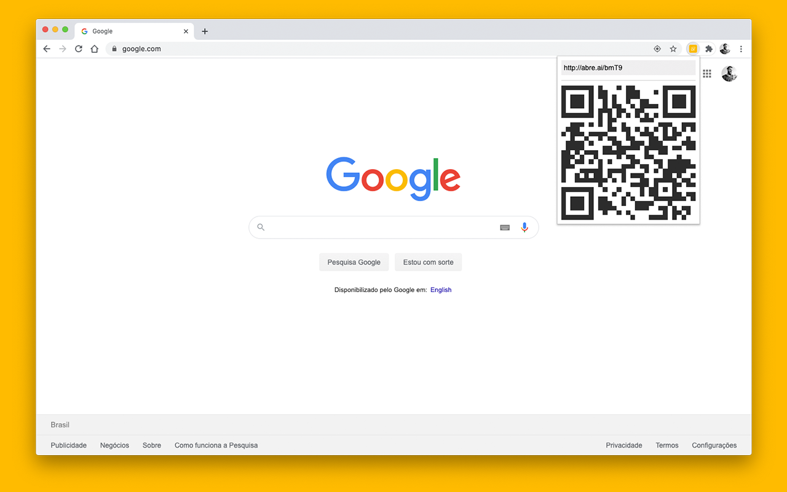

  

<h1 align="center">Abre.ai!</h1>
<h5 align="center">URL Shortener</h5>
 

  
  
  
  
  

 

  <a href="https://github.com/demartini/abreai-url-shortener/issues">Report Bug</a>
  -
  <a href="https://github.com/demartini/abreai-url-shortener/issues">Request Feature</a>

## Table of Contents

- [Table of Contents](#table-of-contents)
- [Screenshots](#screenshots)
- [Installation](#installation)
- [Roadmap](#roadmap)
- [Contributing](#contributing)
  - [Contributors](#contributors)
- [Inspired By](#inspired-by)
- [Changelog](#changelog)
- [License](#license)

## Screenshots

  

  

## Installation

Install the extension through the [Google Chrome Store](https://chrome.google.com/webstore/detail/manbfoambbfcbnhmjbnbggklhoclonnb).

## Roadmap

See the [open issues](https://github.com/demartini/abreai-url-shortener/issues) for a list of proposed features (and known issues).

## Contributing

If you are interested in helping contribute, please take a look at our [Contributing](CONTRIBUTING.md) guide.

### Contributors

## Inspired By

- [abre.ai](https://abre.ai) by [Leandro Nascimento Camargo](https://github.com/leandro).

## Changelog

See [Changelog](CHANGELOG.md) for a human-readable history of changes.

## License

Distributed under the MIT License. See [LICENSE](LICENSE) for more information.